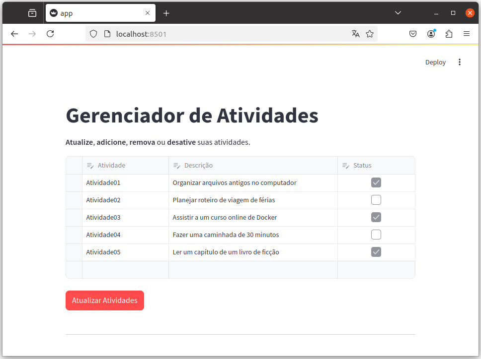

# Criando um CRUD no Streamlit com Docker

Este vídeo demonstra como criar uma aplicação CRUD (Create, Read, Update, Delete) usando o **Streamlit** e o método `st.data_editor`. O aplicativo é desenvolvido para gerenciamento de tarefas, onde é possível adicionar, editar e excluir tarefas diretamente em uma **interface amigável** e interativa.

Além disso, o projeto utiliza **Docker** e **Docker** Compose para configurar o ambiente de desenvolvimento, facilitando a execução da aplicação em qualquer sistema.

<!--
https://www.youtube.com/@renato-coelho
Atividade01;Organizar arquivos antigos no computador;True
Atividade02;Planejar roteiro de viagem de férias;False
Atividade03;Assistir a um curso online de Docker;True
Atividade04;Fazer uma caminhada de 30 minutos;False
Atividade05;Ler um capítulo de um livro de ficção;True
-->

## Apresentação em Vídeo

<p align="center">
  <a href="https://youtu.be/lo0RypWRzpM" target="_blank"></a>
</p>

### Requisitos

+ 

+ 

+ 

+ 

+ 


## Deploy da aplicação

### Clonando o repositório

```bash
git clone https://github.com/Renatoelho/crud-streamlit.git crud-streamlit
```

### Configurando o ambiente com Docker

+ Acesse o diretório do projeto:
```bash
cd crud-streamlit/
```

+ Execute o comando para subir aplicação:
```bash
docker compose -p crud-streamlit -f docker-compose.yaml up -d --build
```

> ***OBS.:*** Para acessar o App, utilize o endereço: [http://localhost:8501](http://localhost:8501)

# Tela do App CRUD

<p align="center">
  </a>
</p>

# Referências

data_editor, **Streamlit.** Disponível em: <https://docs.streamlit.io/develop/api-reference/data/st.data_editor>. Acesso em: 10 jan. 2025.

container, **Streamlit.** Disponível em: <https://docs.streamlit.io/develop/api-reference/layout/st.container#stcontainer>. Acesso em: 10 jan. 2025.

pandas.to_csv, **Pandas.** Disponível em: <https://pandas.pydata.org/docs/reference/api/pandas.DataFrame.to_csv.html>. Acesso em: 10 jan. 2025.

Dockerfile overview, **Docker Docs**.  Disponível em: <https://docs.docker.com/build/concepts/dockerfile/>. Acesso em: 11 Jan. 2025.

How Compose works, **Docker Docs**. Disponível em: <https://docs.docker.com/compose/intro/compose-application-model/>. Acesso em: 11 Jan. 2025.

docker build, **Docker Docs**. Disponível em: <https://docs.docker.com/build/>. Acesso em: 11 Jan. 2025.
